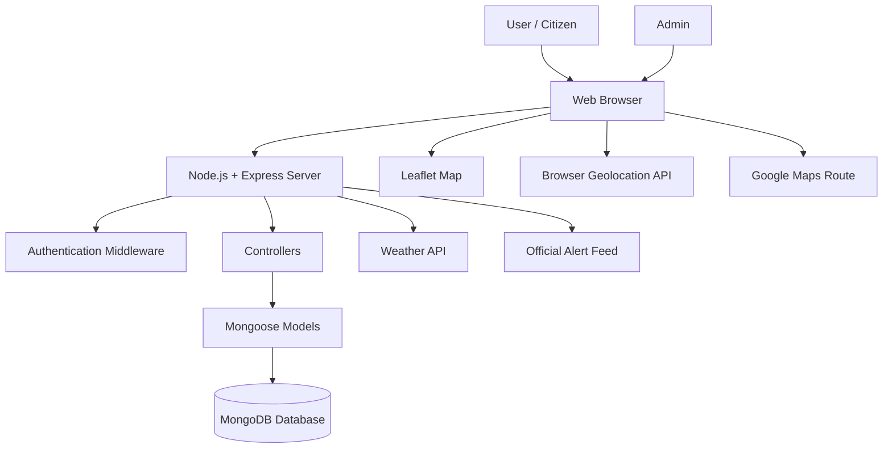
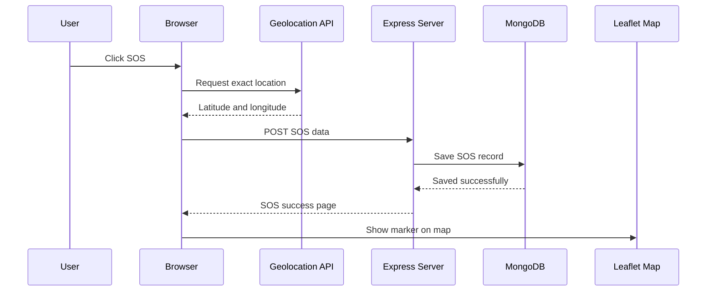
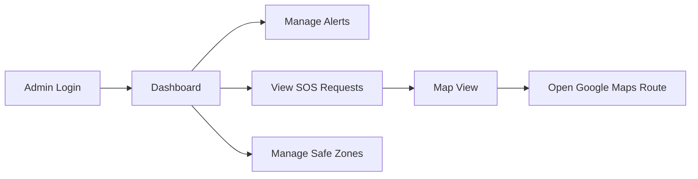
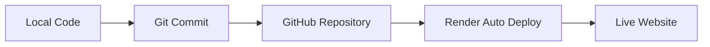

# Rakshak Disaster Alerts

## A Multilingual Disaster Alert and SOS Response Platform

**Project Type:** Full Stack Web Application  
**Frontend:** HTML, CSS, JavaScript, EJS  
**Backend:** Node.js, Express.js  
**Database:** MongoDB  
**Deployment:** Render  
**Submitted By:** ____________________  
**Roll No.:** ____________________  
**Department:** ____________________  
**College:** ____________________  
**Guide:** ____________________  
**Academic Year:** 2025-2026  

<div style="page-break-after: always;"></div>

## Index

| Page No. | Name of Topic |
|---:|---|
| 1 | Abstract |
| 2 | Theme and Problem Statement |
| 3 | Introduction |
| 4 | Literature Survey |
| 5 | Existing System |
| 6 | Proposed Solution 1 |
| 7 | Proposed Solution 2 |
| 8 | Proposed Recommended Solution |
| 9 | Flow Diagram / Architecture of Proposed System |
| 10 | Technical Requirements (Hardware / Software) |
| 11 | Applications |
| 12 | Future Scope |
| 13 | Conclusion |
| 14 | References |
| 15 | System Modules |
| 16 | Database Design |
| 17 | User Interface Design |
| 18 | SOS Location and Map Workflow |
| 19 | Testing and Validation |
| 20 | Security and Privacy Considerations |
| 21 | Deployment and Maintenance |
| 22 | Limitations and Final Summary |

<div style="page-break-after: always;"></div>

## Page 1: Abstract

Rakshak Disaster Alerts is a full-stack web application designed to improve disaster communication, emergency awareness, and SOS response coordination. The platform focuses on multilingual disaster alerts, user-friendly emergency guidance, exact GPS-based SOS reporting, map-based visualization, and admin-managed alert and resource workflows.

During disasters, communication delay and language barriers can reduce the effectiveness of warning systems. Many citizens may receive alerts late, may not understand technical warning language, or may not know the immediate steps to take. Rakshak attempts to reduce this gap by combining alert publishing, regional language support, voice playback, safety guidance, weather context, emergency resources, and SOS location sharing in one web platform.

The system contains two major user roles: normal users and administrators. Users can view local disaster alerts, select preferred language, listen to warnings, view safety guidance, and raise SOS requests. Administrators can create and manage disaster alerts, view SOS requests, track SOS locations on a map, update SOS status, and manage safe zones such as shelters, hospitals, food points, and medical support points.

A key feature of this project is the SOS location module. When a user sends an SOS, the browser Geolocation API captures latitude and longitude using high-accuracy mode. The backend stores the location in MongoDB, and responders can view the victim location on a Leaflet map. The system also provides a Google Maps route link for navigation. If GPS fails, the system allows approximate state/city-based fallback while clearly distinguishing it from exact GPS.

The project is implemented using Node.js, Express.js, MongoDB, EJS templates, vanilla JavaScript, CSS, Leaflet.js, and external services such as official alert feeds and weather APIs. It is deployed on Render, making it accessible through a browser on desktop and mobile devices.

Overall, Rakshak demonstrates how modern web technologies can be used to build a practical disaster alert and emergency response prototype suitable for community safety, college-level research, and future extension into a larger public-safety platform.

<div style="page-break-after: always;"></div>

## Page 2: Theme and Problem Statement

### Theme

The theme of this project is **Disaster Management and Public Safety through Web Technology**. It focuses on improving the way disaster alerts, emergency information, and SOS requests are communicated between authorities, citizens, and responders.

### Background

India faces several natural and human-induced disasters such as floods, cyclones, earthquakes, heatwaves, landslides, fires, and urban emergencies. Although official warning systems exist, the effectiveness of a warning depends on how quickly citizens receive it, whether they understand it, and whether they can act on it.

Disaster communication becomes more difficult in a multilingual country. A warning in only one language may not be useful for all users. In addition, many platforms show alerts but do not provide simple action-based guidance or a direct SOS reporting mechanism.

### Problem Statement

Existing disaster alert systems often face the following problems:

1. Alerts may not be understandable for all users due to language barriers.
2. Users may not receive simple and immediate safety instructions.
3. Emergency SOS requests may not include exact victim location.
4. Administrators may not have a single dashboard for alerts, SOS requests, and safe zones.
5. Users may need multiple apps for alerts, maps, weather, and emergency help.
6. Mobile usability is often weak in emergency-focused web systems.

### Project Problem

The problem addressed by Rakshak is:

**To design and develop a multilingual disaster alert and SOS response web application that allows users to view local alerts, receive guidance, send exact GPS-based SOS requests, and helps administrators manage alerts, SOS records, and emergency resources.**

### Objectives

- Provide disaster alerts based on selected state.
- Support multiple Indian languages for alert messages.
- Provide action-oriented safety guidance.
- Capture exact GPS coordinates during SOS submission.
- Display SOS locations on an interactive map.
- Provide Google Maps route navigation to responders.
- Allow admins to manage alerts, SOS requests, and safe zones.
- Improve mobile accessibility and emergency usability.

<div style="page-break-after: always;"></div>

## Page 3: Introduction

Disaster management depends heavily on communication. A warning that reaches people late or in a language they do not understand may fail to protect lives. Similarly, an emergency request without accurate location may delay rescue or assistance.

Rakshak Disaster Alerts is developed as a web-based solution to combine disaster alerting and emergency response support. The project provides a practical interface for normal users and administrators. Users can register with personal details, select their preferred language, view alerts, listen to alert messages, and send SOS requests. Admins can create alerts, view SOS records, manage safe zones, and update request status.

The project is built using a Model-View-Controller style structure. Express.js handles routing and server-side logic, EJS renders dynamic views, MongoDB stores users, alerts, SOS records, safe zones, and sessions, and JavaScript handles frontend interactions such as geolocation, map rendering, voice playback, and AJAX updates.

### Key Features

- User registration and login.
- Admin dashboard.
- Multilingual alert messages.
- Alert details with precautions and guidance.
- Voice playback for alerts.
- GPS-based SOS submission.
- Nearby SOS page with map markers.
- Admin SOS map and status management.
- Safe zone/resource management.
- Weather widget.
- Responsive mobile layout.

### Need of the System

The system is needed because disaster response is time-sensitive. During emergencies, a user should not have to search through multiple services. A single platform should provide:

- What happened?
- Where did it happen?
- What should I do?
- Where can I get help?
- How can I send my location?
- How can responders reach me?

Rakshak tries to answer these questions through one integrated web application.

### Scope

The current project is a working prototype. It can be used for academic demonstration, local community alert simulation, and emergency workflow testing. With further development, it can be extended into a production-ready disaster communication platform integrated with government alert feeds, SMS gateways, mobile apps, and responder networks.

<div style="page-break-after: always;"></div>

## Page 4: Literature Survey

### Disaster Risk Reduction Frameworks

The Sendai Framework for Disaster Risk Reduction 2015-2030, published by the United Nations Office for Disaster Risk Reduction, emphasizes understanding disaster risk, strengthening governance, investing in resilience, and improving preparedness for effective response. This project aligns with those principles by focusing on early awareness, local preparedness, and emergency response support.

### Official Alert Systems

India's SACHET National Disaster Alert Portal, implemented by the National Disaster Management Authority, provides area-specific alerts from authorized sources. It supports public warning dissemination and disaster-specific safety information. Rakshak takes inspiration from this concept and builds a student-level prototype that combines alert viewing, multilingual guidance, SOS, and maps.

### Web-Based Emergency Communication

Modern emergency systems increasingly use web and mobile interfaces because users already carry smartphones. Web applications have the advantage of being cross-platform and easy to deploy. However, they also have limitations such as browser permission requirements for location access.

### Geolocation in Web Applications

The browser Geolocation API allows websites to request the user's latitude and longitude after permission. The accuracy depends on device hardware, GPS availability, Wi-Fi/cell tower data, browser permissions, and whether the site is served through HTTPS. Rakshak uses high-accuracy geolocation for SOS reporting.

### Map-Based Visualization

Map visualization is important in disaster response because location-based decisions are easier when information is spatial. Leaflet.js is widely used for interactive web maps because it is lightweight and supports markers, popups, tile layers, and map controls. Rakshak uses Leaflet to display alert locations, resource points, and SOS markers.

### Database and Server-Side Development

MongoDB is suitable for this project because records such as users, alerts, resources, and SOS requests can be represented as JSON-like documents. Node.js with Express.js provides a simple and flexible backend for building routes, controllers, middleware, session handling, and API endpoints.

### Literature Gap

Many systems provide alerts, and many apps provide maps, but fewer student-level projects combine:

- Multilingual alerts.
- SOS exact GPS capture.
- Admin dashboard.
- Resource mapping.
- Guidance and voice support.
- Mobile responsive design.

Rakshak addresses this combined workflow in a single application.

<div style="page-break-after: always;"></div>

## Page 5: Existing System

### Overview

Existing disaster communication systems can be divided into official portals, mobile apps, news channels, social media updates, local authority announcements, and emergency helplines. Each has a useful role, but they may not provide a complete user workflow.

### Common Existing Systems

1. Government alert portals.
2. Weather websites.
3. Emergency helpline numbers.
4. Social media disaster updates.
5. News alerts.
6. Mapping applications.
7. Messaging applications for live location sharing.

### Limitations of Existing Systems

#### 1. Language Barrier

Some systems publish alerts in a limited number of languages. In multilingual regions, this reduces reach.

#### 2. Fragmented User Experience

A user may need one platform for alerts, another for maps, another for weather, and another for SOS communication.

#### 3. Lack of Action Guidance

Some alerts inform users about danger but do not clearly explain immediate actions, what to avoid, and emergency kit requirements.

#### 4. Weak SOS Integration

Many systems do not include direct SOS submission with stored GPS coordinates and admin visibility.

#### 5. Limited Admin Control in Prototypes

Academic or demo systems often show static alerts only. Rakshak includes admin management for alerts, SOS, and resources.

#### 6. Mobile Issues

Emergency systems must work well on phones. Existing web prototypes may have small maps, difficult buttons, or poor GPS permission handling.

### Need for Improvement

There is a need for an integrated web platform that:

- Works on mobile and desktop.
- Provides multilingual alert content.
- Captures exact SOS location.
- Shows victims on maps.
- Gives responders route navigation.
- Allows admin monitoring and management.

Rakshak is proposed to address these gaps.

<div style="page-break-after: always;"></div>

## Page 6: Proposed Solution 1

### Solution 1: Basic Disaster Alert Portal

The first proposed solution is a simple disaster alert portal where administrators can publish alerts and users can view them. This solution focuses mainly on alert management.

### Features

- Admin can add alerts.
- Users can view alerts by state.
- Alerts include disaster type, severity, message, and precautions.
- Alerts are stored in MongoDB.
- Users can view alert details.

### Architecture

The basic portal contains:

- Frontend pages for alert listing and details.
- Admin form for alert creation.
- Express routes for alert operations.
- MongoDB collection for alert data.

### Advantages

- Easy to implement.
- Helps users access local alerts.
- Allows admin-controlled warning publication.
- Useful as a minimum viable product.

### Limitations

- No SOS feature.
- No exact victim location.
- No route navigation.
- No multilingual support.
- No safe zone resource module.
- Limited emergency usefulness.

### Evaluation

This solution is useful for information display but not enough for emergency response. A disaster platform should not only display warnings but also allow users to request help and share their location.

### Conclusion for Solution 1

The basic alert portal is a good starting point, but it does not fully solve the problem. It lacks response coordination and user-side emergency reporting.

<div style="page-break-after: always;"></div>

## Page 7: Proposed Solution 2

### Solution 2: Alert Portal with SOS and Map Support

The second proposed solution extends the basic portal by adding SOS reporting and map visualization. Users can send an SOS with their GPS coordinates. Admins and nearby users can view SOS locations on a map.

### Features

- User login and registration.
- State-wise disaster alerts.
- SOS button with geolocation.
- Latitude and longitude storage in MongoDB.
- Admin SOS table.
- Leaflet map markers.
- Google Maps route links.

### Advantages

- Improves emergency response.
- Captures victim location.
- Makes SOS requests visible on a map.
- Helps responders navigate to the victim.
- Works in browser without native app installation.

### Limitations

- Browser location permission is required.
- GPS may fail if phone location is off.
- Location accuracy depends on device and environment.
- Multilingual support still needs improvement.
- Admin decision support is basic.

### Evaluation

This solution is more practical than the first because it includes the emergency reporting workflow. It helps convert the system from an alert-only portal into a response-support platform.

### Conclusion for Solution 2

The second solution is stronger but can be improved by adding multilingual messages, voice playback, weather context, safe zones, and better mobile UI.

<div style="page-break-after: always;"></div>

## Page 8: Proposed Recommended Solution

### Recommended Solution: Rakshak Disaster Alerts

The recommended solution is the full Rakshak system. It combines disaster alerts, multilingual support, SOS location capture, map visualization, safe zone management, weather updates, admin dashboard, and responsive mobile design.

### Why This Solution is Recommended

This solution is recommended because it solves both communication and response problems. It does not stop at publishing alerts; it also helps users understand, act, and request assistance.

### Recommended System Features

1. User authentication.
2. Admin authentication.
3. Disaster alert creation and management.
4. Multilingual alert messages.
5. Voice playback.
6. Alert guidance and precautions.
7. Weather widget.
8. SOS exact GPS capture.
9. SOS database storage.
10. Nearby SOS listing.
11. Leaflet map marker.
12. Google Maps route button.
13. Safe zones/resources.
14. Responsive mobile UI.

### SOS Location Process

When a user clicks SOS:

1. Browser asks for location permission.
2. JavaScript calls `navigator.geolocation.getCurrentPosition()`.
3. High-accuracy GPS is requested.
4. Latitude and longitude are captured.
5. Coordinates are sent to backend with SOS form.
6. Backend stores data in MongoDB.
7. Nearby/admin page displays red marker on Leaflet map.
8. Responder can click Get Route to open Google Maps.

### Benefits

- Faster victim location discovery.
- Better admin visibility.
- Better citizen understanding through language support.
- Improved mobile emergency workflow.
- Centralized alert and resource management.

### Conclusion

The recommended solution is the most complete and practical approach among the proposed alternatives.

<div style="page-break-after: always;"></div>

## Page 9: Flow Diagram / Architecture of Proposed System

### High-Level Architecture



### SOS Workflow



### Admin Workflow



### Architecture Explanation

The system follows a web application architecture. The browser handles user interactions, forms, geolocation, maps, and client-side scripts. Express.js handles routing, validation, sessions, and controller logic. MongoDB stores persistent data. Leaflet.js displays maps, while Google Maps handles route navigation.

<div style="page-break-after: always;"></div>

## Page 10: Technical Requirements (Hardware / Software)

### Hardware Requirements

#### Development System

- Processor: Intel i3/Ryzen 3 or above.
- RAM: Minimum 4 GB, recommended 8 GB.
- Storage: 1 GB free space for project and dependencies.
- Internet: Required for APIs, deployment, and package installation.

#### User Device

- Smartphone, tablet, laptop, or desktop.
- GPS-enabled mobile device for exact SOS location.
- Browser with geolocation support.

### Software Requirements

#### Frontend

- HTML5.
- CSS3.
- JavaScript.
- EJS template engine.
- Leaflet.js map library.

#### Backend

- Node.js.
- Express.js.
- Mongoose.
- Express Session.
- Connect Mongo.

#### Database

- MongoDB Atlas or local MongoDB.

#### Deployment

- Render hosting platform.
- GitHub repository for deployment workflow.

#### APIs and Services

- Browser Geolocation API.
- Open-Meteo API for weather.
- Google Maps direction URL.
- Official disaster alert feed where available.

### Browser Requirements

- HTTPS is required for geolocation on deployed site.
- User must allow location permission.
- Phone GPS/location service must be enabled.

### Development Tools

- Visual Studio Code.
- Git and GitHub.
- npm.
- Browser developer tools.

<div style="page-break-after: always;"></div>

## Page 11: Applications

Rakshak can be used in several real-world and academic contexts.

### 1. Disaster Warning System

The platform can publish alerts for floods, fires, heatwaves, earthquakes, and other emergencies.

### 2. Community Safety Platform

Local communities can use the system to view warnings and emergency safe zones.

### 3. College Campus Emergency System

Institutions can adapt the system for campus emergencies such as fire alerts, evacuation notices, and medical help requests.

### 4. SOS Coordination

Users can send SOS requests with exact GPS location, helping responders identify the victim location.

### 5. Relief Resource Mapping

Admins can map shelters, hospitals, food points, water points, and medical support centers.

### 6. Multilingual Public Communication

The platform can support users who prefer regional languages.

### 7. Emergency Awareness

Preparedness guidance can help users learn what to do before, during, and after disasters.

### 8. Prototype for Government or NGO Systems

The project can be extended by NGOs, student teams, or local government bodies for proof-of-concept emergency response platforms.

<div style="page-break-after: always;"></div>

## Page 12: Future Scope

The current version is a working prototype. It can be expanded in many ways.

### 1. Mobile Application

A native Android/iOS application can improve GPS reliability, background alerts, and push notifications.

### 2. SMS and WhatsApp Alerts

The system can integrate SMS gateways or WhatsApp Business APIs for wider reach.

### 3. Push Notifications

Browser push notifications can alert users even when the website is not open.

### 4. Real-Time SOS Tracking

Socket.io or WebSocket support can update SOS requests in real time.

### 5. Responder Module

Dedicated responder accounts can accept, navigate, and close SOS requests.

### 6. Offline Support

Critical guidance and maps can be cached for offline use.

### 7. AI-Based Alert Summary

AI can summarize official alerts into simple action steps.

### 8. Risk Prediction

Weather, historical disaster, and geographic data can be used for risk scoring.

### 9. Multi-Agency Dashboard

Different agencies can manage alerts for their own regions.

### 10. Accessibility Improvements

Support for screen readers, larger buttons, and low-bandwidth modes can be expanded.

<div style="page-break-after: always;"></div>

## Page 13: Conclusion

Rakshak Disaster Alerts is a practical full-stack project that addresses a meaningful public-safety problem. It combines disaster alerting, multilingual communication, safety guidance, SOS reporting, map visualization, safe zone management, and responsive design.

The project demonstrates how modern web technologies can support emergency communication. Node.js and Express.js provide the backend foundation, MongoDB stores dynamic data, EJS renders server-side pages, and JavaScript handles geolocation and map interaction. Leaflet.js provides an interactive map interface, while Google Maps route links help responders navigate to victims.

The most important contribution of the project is the SOS location system. By capturing latitude and longitude through the browser Geolocation API, the system can store victim location and display it on a map. This directly supports faster response during emergencies.

The project also recognizes real-world limitations. Browser-based GPS requires user permission, HTTPS, and phone location services. Therefore, the system includes permission handling, loading messages, retry support, and approximate fallback.

In conclusion, Rakshak is a useful academic and practical prototype. It can be improved further with native mobile apps, push notifications, real-time updates, responder accounts, and stronger official integrations. Even in its current form, it demonstrates a strong understanding of full-stack development and disaster management workflows.

<div style="page-break-after: always;"></div>

## Page 14: References

1. United Nations Office for Disaster Risk Reduction. *Sendai Framework for Disaster Risk Reduction 2015-2030*.  
   https://www.undrr.org/publication/sendai-framework-disaster-risk-reduction-2015-2030

2. United Nations Office for Disaster Risk Reduction. *What is the Sendai Framework?*  
   https://www.undrr.org/implementing-sendai-framework/what-sendai-framework

3. National Disaster Management Authority, Government of India. *SACHET National Disaster Alert Portal*.  
   https://sachet.ndma.gov.in/

4. Express.js. *Node.js Web Application Framework*.  
   https://expressjs.com/

5. MongoDB Documentation. *MongoDB Node.js Driver*.  
   https://www.mongodb.com/docs/drivers/node/current/

6. Leaflet. *Leaflet JavaScript Library Documentation*.  
   https://leafletjs.com/

7. Open-Meteo. *Weather API Documentation*.  
   https://open-meteo.com/en/docs

8. MDN Web Docs. *Geolocation API*.  
   https://developer.mozilla.org/en-US/docs/Web/API/Geolocation_API

9. Google Maps Platform. *Maps URLs / Directions*.  
   https://developers.google.com/maps/documentation/urls/get-started

10. Render. *Cloud Application Hosting Platform*.  
    https://render.com/docs

<div style="page-break-after: always;"></div>

## Page 15: System Modules

### 1. Authentication Module

The authentication module allows users to register, log in, update profile details, and log out. It stores user details such as name, email, phone, state, city, language, role, and emergency contact.

### 2. Alert Module

The alert module allows admins to create, update, delete, and list disaster alerts. Users can view alerts according to selected state and language.

### 3. Guidance Module

This module builds simplified guidance for alerts. It provides immediate actions, avoid actions, checklist items, and helpline details.

### 4. SOS Module

The SOS module captures emergency requests. It stores user name, message, contact, state, city, latitude, longitude, status, responder, and timestamp.

### 5. Nearby SOS Module

This module displays SOS requests for the user's state. It includes request cards and an interactive map.

### 6. Admin Dashboard Module

The admin dashboard shows counts, latest alerts, SOS request statistics, severity distribution, and quick actions.

### 7. Resource Module

This module manages safe zones such as shelters, hospitals, water points, food points, and medical support points.

### 8. Weather Module

This module fetches weather data for the selected state using coordinates and displays temperature, wind, status, and weather description.

<div style="page-break-after: always;"></div>

## Page 16: Database Design

### User Collection

Important fields:

- name
- email
- phone
- password
- state
- city
- language
- role
- emergencyContactName
- emergencyContactPhone

### Alert Collection

Important fields:

- title
- disasterType
- state
- city
- severity
- latitude
- longitude
- multilingual messages
- precautions
- createdAt

### SOS Collection

Important fields:

- user
- userName
- contactNumber
- state
- city
- distressMessage
- latitude
- longitude
- locationAccuracy
- locationSource
- locationCapturedAt
- status
- urgency
- assignedVolunteer
- responderName
- createdAt

### Resource Collection

Important fields:

- name
- type
- state
- city
- address
- latitude
- longitude
- capacity
- contactPhone
- isActive

### SafeCheck Collection

Important fields:

- user
- userName
- alert
- status
- location
- message

### Database Design Advantages

- Document-based storage is flexible.
- MongoDB works well with JavaScript objects.
- Mongoose schemas provide validation.
- Records can grow as the system expands.

<div style="page-break-after: always;"></div>

## Page 17: User Interface Design

### Design Goals

The UI is designed for emergency usability. It should be clear, responsive, readable, and fast to operate on mobile.

### Important UI Screens

1. Home page.
2. Login and registration.
3. User alerts page.
4. Alert details page.
5. SOS success page.
6. Nearby SOS page.
7. Admin dashboard.
8. Manage alerts.
9. Manage SOS requests.
10. Manage safe zones.

### UI Principles

- Large buttons for emergency actions.
- Clear severity badges.
- Responsive maps.
- Short guidance text.
- Mobile-friendly forms.
- High contrast text.
- Dark mode support.
- Accessibility mode support.

### Mobile UI Improvements

The system uses responsive CSS. On mobile:

- Map height becomes 70vh.
- SOS button becomes larger.
- Forms stack vertically.
- Navigation links wrap.
- Tables scroll horizontally.
- Cards use one-column layout.

### Accessibility

The system includes accessibility mode and voice playback. These features help users with visual or reading difficulty understand alerts more easily.

<div style="page-break-after: always;"></div>

## Page 18: SOS Location and Map Workflow

### SOS Location Capture

When the user clicks SOS, the frontend JavaScript calls:

```js
navigator.geolocation.getCurrentPosition(success, error, {
  enableHighAccuracy: true,
  timeout: 10000,
  maximumAge: 0
});
```

### Success Case

If permission is allowed and GPS is available:

- Latitude is captured.
- Longitude is captured.
- Accuracy is captured.
- Values are added to hidden form fields.
- Form is submitted to `/sos`.
- Backend saves the request.

### Failure Case

If GPS fails:

- User receives an error message.
- User can retry permission.
- User can send approximate request using state/city.

### Map Display

Nearby SOS page uses Leaflet:

```js
L.marker([latitude, longitude])
```

Latitude is passed first and longitude second.

### Marker Behavior

When a card is clicked:

- Map centers on victim location.
- Zoom level becomes 15 for exact GPS.
- Popup opens.

### Popup Information

The popup displays:

- Name.
- Message.
- Time.
- Status.
- Accuracy information.

### Route Navigation

The Get Route button opens:

```text
https://www.google.com/maps/dir/?api=1&destination=LAT,LNG
```

This opens Google Maps route navigation for responders.

<div style="page-break-after: always;"></div>

## Page 19: Testing and Validation

### Testing Strategy

Testing was performed at different levels:

1. Syntax testing.
2. Template compilation.
3. Database connection test.
4. Route smoke test.
5. SOS location workflow test.
6. Mobile UI test.

### MongoDB Test

The project includes a database connection script to test MongoDB Atlas connectivity. A successful connection confirms that the backend can reach the database.

### JavaScript Syntax Test

Node syntax checks were used for server and client JavaScript files. This helps catch syntax errors before deployment.

### EJS Template Test

All EJS views were compiled to detect template errors such as missing brackets or invalid JavaScript expressions.

### SOS Test Cases

| Test Case | Expected Result |
|---|---|
| Location allowed | Latitude and longitude captured |
| Location denied | Permission message shown |
| GPS timeout | Retry/fallback shown |
| SOS saved | MongoDB stores record |
| Nearby page opened | Marker shown on map |
| Card clicked | Map zooms to victim |
| Get Route clicked | Google Maps opens |

### Mobile Testing

Mobile testing focused on:

- Large SOS button.
- Map height.
- Permission prompt.
- Form usability.
- Route button.

### Result

The system successfully supports alert display, SOS submission, map display, and admin monitoring.

<div style="page-break-after: always;"></div>

## Page 20: Security and Privacy Considerations

### Authentication

The system uses sessions to maintain logged-in users. Admin routes are protected using role-based middleware.

### Password Security

Passwords are hashed before storage using bcrypt.

### Location Privacy

SOS location is sensitive data. The system requests location only when needed for emergency reporting. It stores latitude and longitude only after user action and browser permission.

### Browser Permission

Websites cannot access exact location without permission. This protects users from unauthorized tracking.

### Data Validation

Mongoose schemas validate many fields, including role, status, severity, latitude, and longitude.

### XSS Prevention

Dynamic data shown in JavaScript-generated cards and map popups should be escaped before rendering. The project includes escaping utilities for SOS display.

### Service Worker Safety

The service worker is configured to avoid intercepting non-GET requests. This prevents SOS POST submissions from being blocked by cache logic.

### Recommended Improvements

- Add CSRF protection.
- Add request rate limiting.
- Add stronger admin secret management.
- Add audit logs for admin actions.
- Encrypt sensitive location records if required.

<div style="page-break-after: always;"></div>

## Page 21: Deployment and Maintenance

### Deployment Platform

The project is deployed on Render. Render can automatically redeploy the application when changes are pushed to the connected GitHub repository.

### Deployment Flow



### Environment Variables

Important environment variables:

- `PORT`
- `MONGO_URI`
- `SESSION_SECRET`
- `ADMIN_SECRET`
- `ADMIN_EMAIL`
- `ADMIN_PASSWORD`

### Maintenance Tasks

- Monitor Render deployment logs.
- Check MongoDB Atlas connection.
- Keep dependencies updated.
- Test location permission on mobile.
- Verify service worker cache version after changes.
- Backup database records.
- Review admin-created alerts.

### Common Deployment Issues

1. Missing environment variables.
2. MongoDB IP/network access restrictions.
3. Old browser cache or service worker.
4. HTTPS and location permission issues.
5. Port conflicts in local development.

### Maintenance Recommendation

After every deployment, test:

- Home page.
- Login.
- Alerts page.
- SOS submission.
- Nearby SOS map.
- Admin dashboard.

<div style="page-break-after: always;"></div>

## Page 22: Limitations and Final Summary

### Limitations

1. Browser GPS depends on user permission.
2. Exact location requires HTTPS.
3. Phone GPS must be enabled.
4. Indoor GPS accuracy may be weak.
5. The system is a prototype, not an official government emergency system.
6. Real-time responder tracking is not implemented.
7. Push notifications are not implemented.
8. SMS fallback is not implemented.
9. Offline maps are not available.
10. Admin verification workflow can be improved.

### Final Summary

Rakshak Disaster Alerts is a full-stack disaster management prototype that combines alert communication and emergency SOS support. It provides multilingual alerts, alert guidance, voice support, exact GPS SOS capture, admin monitoring, safe zone management, and map-based visualization.

The system addresses a real-world problem: during emergencies, users need clear information and quick help. Rakshak allows users to understand alerts and send SOS requests with location. Admins can monitor requests and view them on a map.

The project also demonstrates important full-stack development concepts:

- Server-side routing.
- Database modeling.
- Authentication.
- Session handling.
- Geolocation.
- Map rendering.
- API integration.
- Deployment.
- Responsive UI design.

Although it is a prototype, Rakshak has strong potential for future improvement. With native mobile support, push notifications, SMS, real-time updates, official integrations, and responder workflows, it can become a more complete emergency response system.

### Final Statement

Rakshak shows how technology can support public safety by improving disaster awareness, reducing communication gaps, and helping responders locate people in need.

